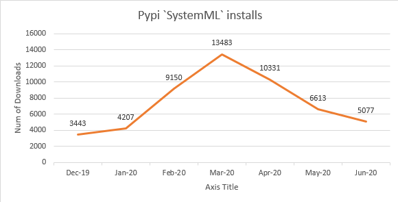
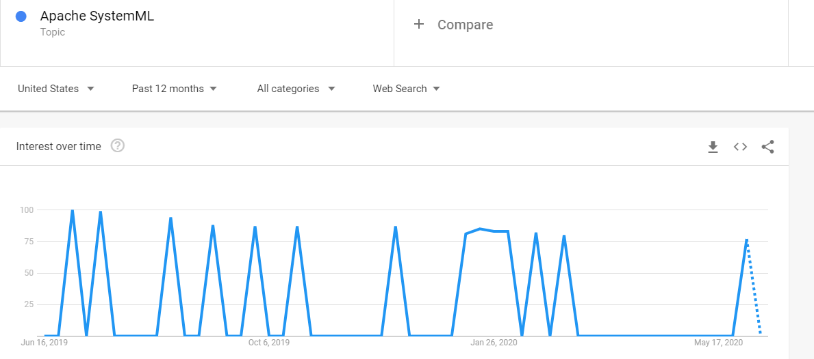
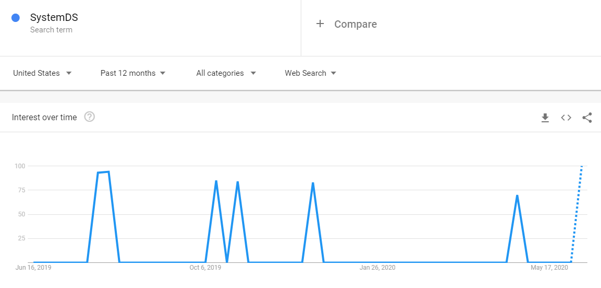

### SystemML python pip install downloads

[Google Bigquery](https://console.cloud.google.com/bigquery) script:
```sql

SELECT
  COUNT(*) AS num_downloads,
  SUBSTR(_TABLE_SUFFIX, 1, 6) AS `month`
FROM `the-psf.pypi.downloads*`
WHERE
  file.project = 'systemml'
  -- Only query the last 6 months of history
  AND _TABLE_SUFFIX
    BETWEEN FORMAT_DATE(
      '%Y%m01', DATE_SUB(CURRENT_DATE(), INTERVAL 6 MONTH))
    AND FORMAT_DATE('%Y%m%d', CURRENT_DATE())
GROUP BY `month`
ORDER BY `month` DESC
```
(Reference source: [Pypi Guide](https://packaging.python.org/guides/analyzing-pypi-package-downloads/))

#### Results

| num_downloads | month |
| --- | --- |
| 5077 | 202006 |
| 6613 | 202005 |
| 10331 |202004 |
| 13483 | 202003 |
| 9150 | 202002 |
| 4207 | 202001 |
| 3443 | 201912 |

#### Graphic




### Companies Using SystemML

| #  	| Company                              	| URL                     	| Industry          	| Sub-Industry                                      	|
|----	|--------------------------------------	|-------------------------	|-------------------	|---------------------------------------------------	|
| 1  	| Aspera Inc.                          	| asperasoft.com          	| Technical         	| Software Development & Technical Consulting       	|
| 2  	| Facebook                             	| facebook.com            	| Media & Internet  	| Information Collection & Delivery                 	|
| 3  	| Fordham University                   	| fordham.edu             	| Education         	| Colleges & Universities                           	|
| 4  	| General Motors                       	| gm.com                  	| Manufacturing     	| Automobiles & Auto Parts                          	|
| 5  	| GM Financial                         	| gmfinancial.com         	| Entertainment     	| Film/Video/Theatrical Production & Services       	|
| 6  	| IBM                                  	| ibm.com                 	| Technical         	| Software Development & Technical Consulting       	|
| 7  	| KBR                                  	| kbr.com                 	| Construction      	| Architecture, Engineering & Design                	|
| 8  	| LifeStream Blood Center              	| lstream.org             	| Healthcare        	| Hospitals & Clinics                               	|
| 9  	| Python                               	| python.org              	| Technical         	| Software Manufacturers                            	|
| 10 	| S4 Inc.                              	| s4inc.com               	| Business Services 	| Security Products & Services                      	|
| 11 	| Systems Planning & Analysis Inc.     	| spa.com                 	| Manufacturing     	| Cosmetics, Beauty Supply & Personal Care Products 	|
| 12 	| The Garrett Group                    	| garrettgp.com           	| Business Services 	| Management & Business Consulting                  	|
| 13 	| University of Louisiana at Lafayette 	| louisiana.edu           	| Education         	| Colleges & Universities                           	|
| 14 	| Virtual Power Systems                	| virtualpowersystems.com 	| Technical         	| Software Development & Technical Consulting       	|
| 15 	| Wells Fargo                          	| wellsfargo.com          	| Finance           	| Banking                                           	|

(source: [hgdata](https://discovery.hgdata.com/product/apache-systemml))

### Interest over time for SystemML(DS)

#### Apache SystemML



#### SystemDS


